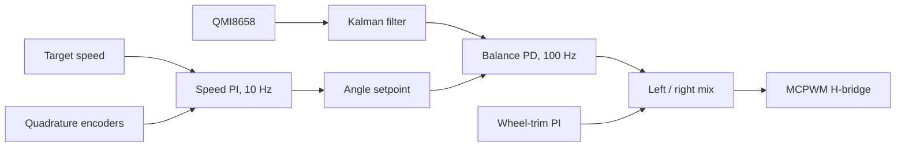
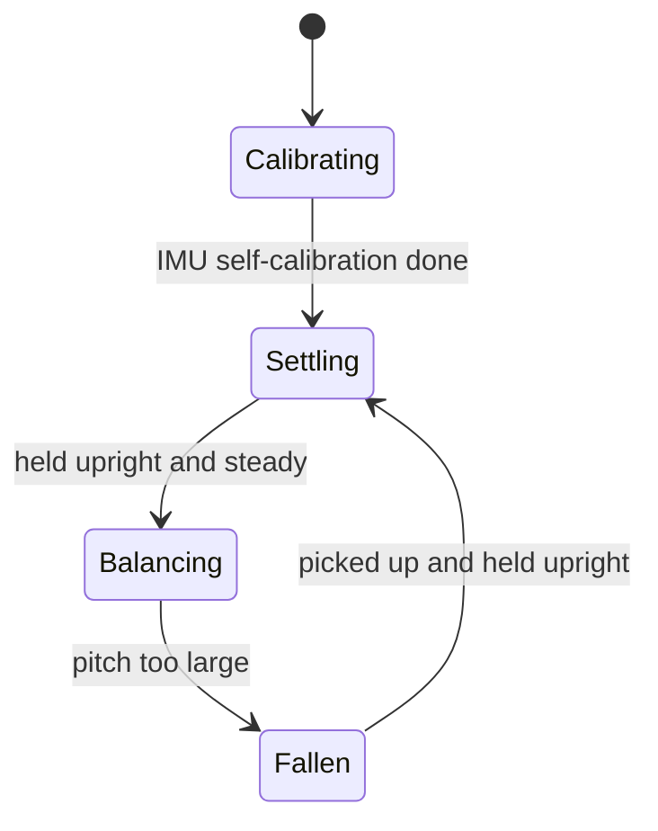

# ESP32 Self-Balancing Robot

A two-wheeled robot that balances itself on an ESP32. A 100 Hz control task fuses a QMI8658 IMU with wheel encoders, runs a cascade of PID loops, and drives the motors through MCPWM. Pick the robot up after a fall and it settles and starts balancing again, without a reboot.

The firmware is paired with a MuJoCo simulator that runs the same controller, including a discrete LQR you can switch to live, and a desktop app for driving and PID tuning over UDP.

https://github.com/user-attachments/assets/8b719d6f-a049-4152-96c9-c822f076874d

## What this demonstrates

- **Hard real-time control on FreeRTOS.** The balance loop is pinned to core 1 at the highest priority and runs at a fixed 100 Hz (`vTaskDelayUntil`). Bluetooth and the network stack stay on core 0.
- **Sensor fusion and motor control from the ESP-IDF drivers.** Pitch comes from a 1-D Kalman filter over the accelerometer angle and gyro rate. Wheel speed comes from quadrature decoding in the PCNT peripheral. Motor voltage is set with MCPWM into an H-bridge.
- **A control design that was debugged, not just tuned.** An earlier outer loop on encoder *position* looked stable and could not be tuned. Replacing it with a speed PI cut the code in half and made the gains meaningful. The balance D-term reads the gyro directly, so a step in the angle setpoint does not kick the motors.
- **The same controller in simulation and on the robot.** `sim/control.py` is a port of the firmware control task, so gains and failure cases can be tried before flashing.
- **A small telemetry protocol.** Protobuf messages over UDP, with a PySide6 dashboard for setpoints and PID gains.

## How it stays upright

The inner loop balances. The outer loop decides *which* angle to balance at, so the robot holds a speed instead of drifting. If the robot drifts forward the outer PID loop changes the setpoint of the inner-loop.



The speed loop runs once every ten balance cycles. Its output is smoothed before it becomes the angle setpoint, so a new speed command does not snap the robot forward. A third PI-controller trims the left/right distance so the robot drives straight and makes it steerable by changing the trim setpoint.

Pitch is `atan2` of the accelerometer, corrected every cycle by the gyro through a Kalman filter that also estimates gyro bias. Above about 42° the motors cut. Below that, the robot is in one of three modes:



`Settling` keeps the motors off until the robot has been held near upright for a few cycles. Integrators, the Kalman state and the encoder counts are cleared on entry to `Balancing`, so a fall does not leave windup in the next attempt.

## Hardware

| Part | Role |
| --- | --- |
| ESP32 | Control, Wi-Fi, Bluetooth HID host |
| Waveshare general robot controller | Motor drivers and IO |
| QMI8658 | 6-axis IMU on I2C (`0x6B`, SDA 32, SCL 33) |
| Two geared DC motors with quadrature encoders | Driven by MCPWM at 20 kHz, direction via an H-bridge |

Pin assignments live in [`code/balancingbot/main/board.h`](code/balancingbot/main/board.h). The MuJoCo model in [`sim/robot.xml`](sim/robot.xml) is a MG310-class motor with 47 mm wheels, 0.68 kg of chassis and the IMU at the top of the frame. Those numbers are estimates used to linearize the plant; they are not a calibrated system identification.

The Waveshare QMI8658 component (v1.0.1) maps the gyro full-scale register one step off the datasheet: `256 dps` programmed the `128 dps` range, so the rate came back at half scale. The driver in this repo uses the datasheet mapping.

## Software

| Task | Core | Job |
| --- | --- | --- |
| `pid_control_task` | 1, highest priority | 100 Hz state machine, fusion and PID |
| `bt_control_task` | 0 | Scan and open a Bluetooth HID gamepad |
| UDP input / output | 0 | Protobuf config in, telemetry out. Compiled out unless `WIFI_ENABLED` is set |

`WIFI_ENABLED` in [`main.c`](code/balancingbot/main/main.c) is off by default, so the robot balances with no network. Turn it on to expose UDP port `3334`, advertised as `_tnc._udp` via mDNS (`balancingbot.local`). Messages are defined in [`protobufs/robot.proto`](protobufs/robot.proto): set PID gains, set a speed and turn rate, request the current gains.

## Repository layout

```
code/balancingbot/   ESP-IDF firmware
dashboard/           PySide6 app: drive, tune PIDs, plot telemetry
protobufs/           Shared message definitions
sim/                 MuJoCo plant, firmware PID port, discrete LQR
```

## Build and run

### Firmware

ESP-IDF 5.x, target `esp32`. The new I2C, MCPWM and PCNT drivers are required.

```bash
cd code/balancingbot
idf.py set-target esp32
idf.py build flash monitor
```

Hold the robot still while the IMU calibrates (about three seconds), then hold it upright. It starts balancing on its own. After a fall, pick it up and hold it upright again.

To enable the dashboard link, define `WIFI_ENABLED` in `main.c` and put the SSID and password in a local config that is not committed. The control task does not depend on Wi-Fi.

### Simulator

```bash
cd sim
pip install mujoco numpy scipy
python sim.py
```

| Key | Action |
| --- | --- |
| A / D or arrow keys | Push the chassis |
| M | Cut or restore the motors |
| L | Switch between the firmware PID and LQR |
| R | Reset the pose |

`python lqr.py` prints the linearized `A` and `B`, the gain `K`, and a C snippet. The LQR uses the true pitch and wheel speed from the simulator. It is a comparison against the PID, not a controller that runs on the ESP32.

### Dashboard

```bash
cd dashboard
pip install -r requirements.txt
python main.py
```

The app sends `SetPidParams` and `SetRobotControl` to the IP and port set in `dashboard/main.py`. The robot must be built with `WIFI_ENABLED`, and the firmware subscriber address has to match the PC. The telemetry plots are laid out and not fed yet: the firmware packet path and the dashboard decoder are both unfinished.

## Status

| Area | State |
| --- | --- |
| Balance, speed and straight-line trim on the robot | Working |
| Fall detection and recovery without a reboot | Working |
| MuJoCo sim of the same PID | Working |
| UDP: set gains, speed and turn rate | Working when Wi-Fi is enabled |
| UDP: telemetry plots, gain readback, ACKs | Not finished |
| Bluetooth HID: scan, connect, read axes | Working, not yet applied to the speed setpoint |
| INA219 current/voltage sensing | Dependency only, not read in the control loop |

## Roadmap

- Close the telemetry loop: sequence numbers, PID terms and mode, decoded in the dashboard.
- Feed the HID stick into `target_speed` and `target_turn_rate`, with a timeout that commands zero if the link drops.
- Read the INA219 and stop driving on undervoltage or overcurrent.
- Add distance sensors so a speed command is cut before the robot hits something.
