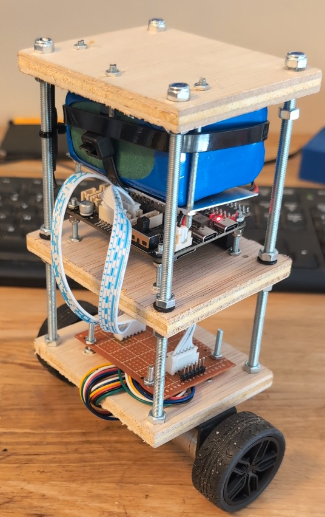
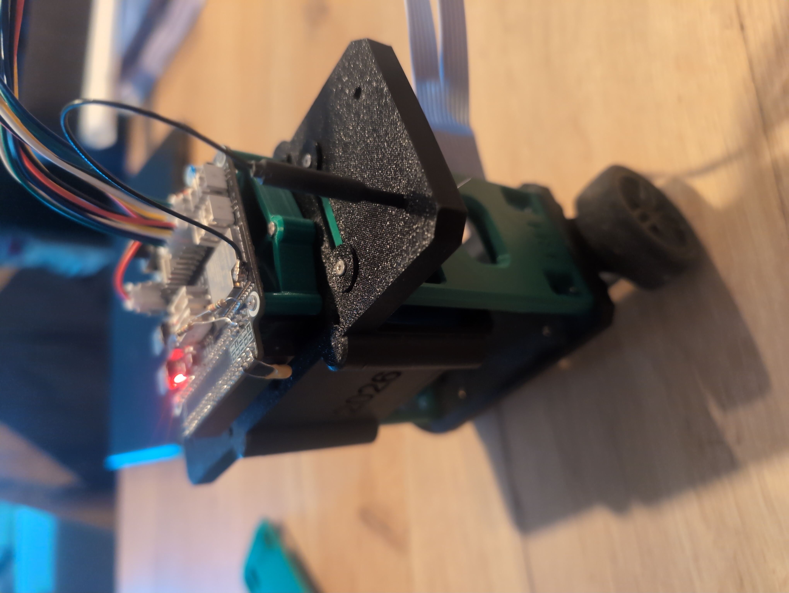
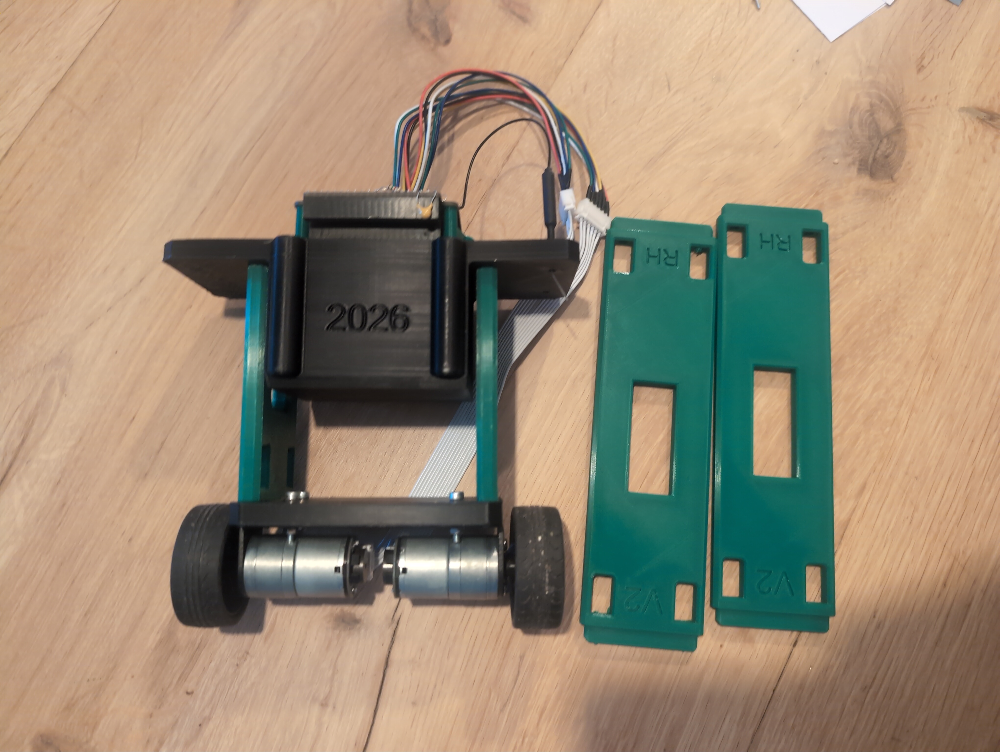

# Revision 1

The first chassis was an elongated version of a frame I bought online. It was very brittle, and the robot kept oscillating. Video showed the battery bending the platform on every forward and backward move. That flex pulled on the IMU, which then produced false readings and severe oscillation. Sadly i  didnt have a picture of the full build anymore but the battery was tiewrapped to the bottom of the middle platform.

# Revision 2

Far uglier than revision 1, but much tougher and stiffer. I made this frame in half an hour, and it looked like it. It confirmed that the IMU was being pulled by the flexing chassis, and that problem went away immediately. I did a lot of testing on this frame and got the robot to balance well. In parallel I started a CAD model for a stiffer, better-looking frame.

# Revision 3

Most likely the final version. It works well, takes severe impacts, and is very stiff. I later 3D-printed elongated side parts so I could lengthen the robot, see how that changed its behaviour, and fine-tune it further. The battery fits snugly in the bay under the PCB mount and has no play. The only thing I would still improve is a hole on the other side, so I can push the battery back out easily.

