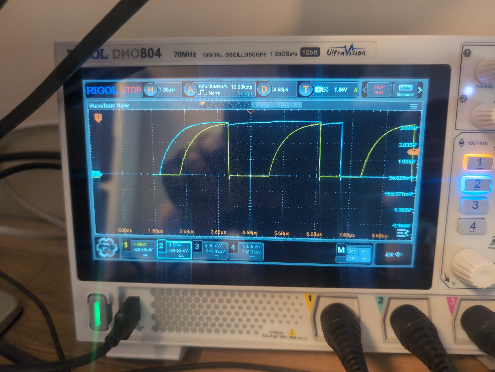
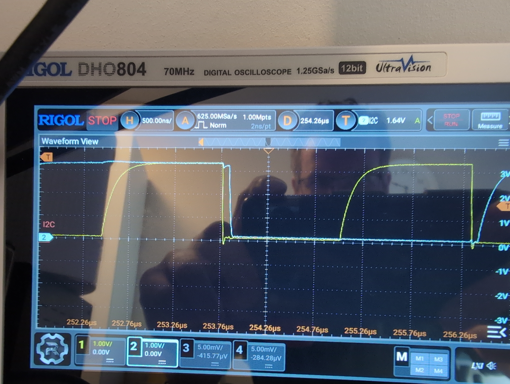

# I2C hardware debugging

At some point I started getting I2C bus errors, and my code reported that it was unable to read the IMU. This mostly happened after connecting the battery to the PCB.

At first I did not have access to an oscilloscope, so I added a decoupling capacitor to see if anything changed. My thought was that the battery might not deliver a clean output voltage, although I considered that unlikely. The capacitor did not fix the issue, so I continued searching.

Next I found that the 3.3 V rail was far too high, at around 4.4 V (measured with a multimeter). For a while I thought the PCB was destroyed. Swapping out the voltage regulator fixed the 3.3 V rail. The old one seems to have been damaged from a short created by measuring certain pins on the PCBs. When the battery was disconnected and the board was powered over USB, the I2C problems seemed to go away. I also tried adding extra pull-up resistors of around 10 kΩ in parallel with the onboard ones, but this did not help.

After I got an oscilloscope, I was able to find the cause. The pull-up resistors were too large: after a bit was sent, the bus took around 1uS to rise back to 3.3v, and the signal looked like a shark fin instead of a square wave. At 400kHz the rise time should be 300nS at max. Adding a lower-value (1K) pull-up resistor in parallel fixed the issue.

